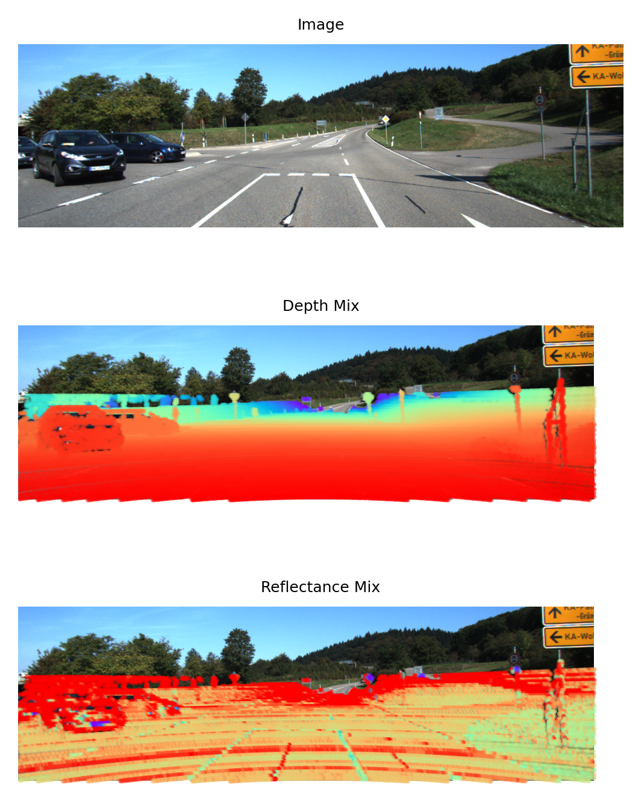

# Lidar to camera projection
Support KITTI and ROS data
## Compare to Original Code
Add comprehensable annotation and add reflectance projection.
## Intro
[中文博客](https://www.cnblogs.com/azureology/p/14004131.html)

This is a Python implementation of how to project point cloud from Velodyne coordinates into the left color image with KITTI data set, or use data collected and calibrated by yourself.
## Dependices
```
matplotlib == 3.1.3
numpy == 1.18.1
```

Also tested with
```
matplotlib == 3.4.3
numpy == 1.23.5
```
## Usage
### KITTI dataset
Download KITTI dataset and place `proj_velo2cam.py` in the root path.
```
python3 proj_velo2cam.py
```
### ROS record data
You are assumed knowing how to use ROS(robot operating system), and you have record a rosbag of image and point cloud, and you also got a calibration parameter files.

Use extract_img_pc_from_rosbag.py to extract image in rosbag:
```
python extract_img_pc_from_rosbag.py
```

Use pcl_ros package to extract point cloud, and use rosbag play to play the bag:
```
rosbag play <your_ros.bag>
rosrun pcl_ros pointcloud_to_pcd input:=/points_raw
```

## Quick demo
### KITTI dataset
Just clone the whole repo and run `proj_velo2cam.py`.
By default, run with frame 000007 with path below:
```
.
├── data_object_image_2
│   └── testing
│       ├── image_2
│       │   └── 000007.png
│       └── projection
│           └── 000007.png
├── data_object_velodyne
│   └── testing
│       └── velodyne
│           └── 000007.bin
├── proj_velo2cam.py
├── readme.md
└── testing
    └── calib
        └── 000007.txt
```
#### Projection Result


### ROS data
todo:
